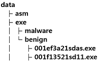

# m4ML(malware for Machine Learning)

## Introduction
The project that manage m4ML tool which used for feature extraction and conversion to libSVM data format.

## Prerequisite 

this tool programmed by the python language. 
The version of installed package should be same with this requirement. 

* Requirement
  * `python == 2.7.13`  
  * `argparse == 1.1`
  * `tqdm == 4.28.1`
  * `numpy == 1.15.4`

* m4ML Diretory Structure
  * **./conf**
    * **./conf/features.conf** : it contains the list of features to be extracted.
    * **./conf/mergence.conf** : it specify the index that each features starts at.
    * **./conf/settings.conf** : it contains general settings. (e.g. job number)
    
  * **./resource**
    * It has not specific meaning. you can just locate your data in this folder.
    
  * **./src**
    * It has python code to work.
    

* Input Directory Requirement  
 Input directory should have this structure down below and satisfy that ...
   * Root directory should be one.
   * Level 2 directory represents the extension of files.
   * Level 3 directory represents the clasees of data (e.g. malware, benign, trojan, etc...)
   
 
 
 ## How to use
 
 The m4ML Tools has 3 stages(modes) to feature extraction.
 * Extraction : it extracts features from input data
 * Labeling : it makes a csv file that can map a filename to a class
 * Encoding : it encodes index of features and merge multiple feature into one file(libsvm format file).
 
 The usage is down below. Each stage can be launched by executing python script named `MalProc.py`
 > python MalProc.py [-h] -M Mode [-j NJOBS] [-i INPUT] [-o OUTPUT] [-f FEATURE] [-s SAMPLING] [-e ENCODINGCONF] [-n NAMEENCODERPATH]
 
 There are paramerters to specify value.
 
 | Parameters|  Description | Extraction | Labeling | Encoding |
| --- |  --- | :---: | :---: | :---: |
| -M  (--Mode)| specify mode to launch (extraction, labeling or encoding) | ○ | ○ | ○ |
| -j (--njobs)| specify the number of workers(cpu processor) to run parallel extraction | △ | Ⅹ | Ⅹ |
| -i (--input)| specify input directory path | ○ | ○ | ○ |
| -o (--output)| specify output path to save result | Ⅹ | △ | △ |
| -f (--feature)| if the number of feature you want to extract is one, specify the feature name | △ | Ⅹ | Ⅹ |
| -s (--sampling)| specify sampling ratio or the number of data | Ⅹ | Ⅹ | △ |
| -n (--nameEncoderPath)| specify labeling file path | Ⅹ | Ⅹ | △ |

 